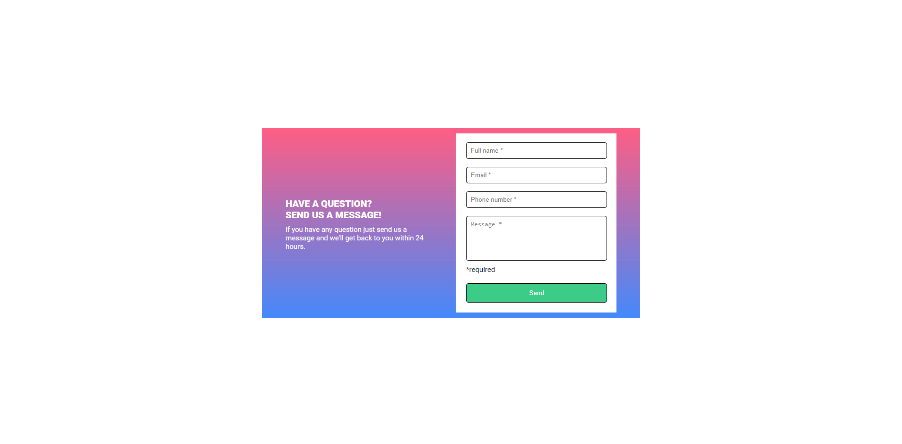

## Table of Content

- [Overview](#overview)
  - [The challenge](#the-challenge)
  - [Screenshot](#screenshot)
  - [Links](#links)
- [My process](#my-process)
  - [Built with](#built-with)
  - [What I learned](#what-i-learned)

## <h2 id="overview">Overview</h2>

### <h3 id="the-challengeo">The Challenge</h3>

The challenge was to create a form that checks if the boxes were filled once the submit button was pressed, and if it wasn't then display a "required" message below the box, turning the box's border red.

### Screenshot

Desktop View

### Links

- URL for hte solution on GitHUb: [Link GitHub](https://github.com/AgnerShimokawa/form-with-validation)
- URL of the live site: [Link of site](https://agnershimokawa.github.io/form-with-validation/)

## <h2 id="my-process">My Process</h2>

### Built with

- Semantic HTML5 markup
- CSS custom properties
- Flexbox
- JavaScript

### <h3 id="what-i-learned">What I Learned</h3>

The process in creating the visual side was fairly simple, only part that I had a little bit of difficulty was deciding how to create a separate tag for the required message for each box, since my first iteration of the HTML had all the message being separated from their corresponding boxes.

With this project I've learned how to store elements from DOM in a array and while looping through one make changes to another using the first one index.

I've tried to use a a forEach loop, however I couldn't find a way to loop through another array inside the forEach loop so I use a simple for loop and use the index to loop through the other one.
To change the color to red and show the required message I use the same tag, since the message doesn't have a border, changing the color would not affect the message, and since the box already has a opacity of 1, it doesn't affect the opacity of the box. 
I don't know if it was required to change only the boxes that wasn't filled, or to change all, but I felt like it made more sense to change only what was filled or not filled separately, and the changes are only applied once the submit button is pressed.